# CalaplayUpper

[中文](README.md) | **English**

One-stop **static `_P` patch builder** for CalaPlayer
(`CalaPlayerSrcmBuilder`).

Drop your own images / audio into a `srcm` folder, run one command, and get a
`CalaPlayer-Windows_P.{pak,ucas,utoc}` you can copy straight into the game —
**without touching a single byte of the original assets**, and with a one-click
rollback.

> This folder was split out of `D:\dsharnessProject\CalabiyauGalMaker` (CP-32):
> the reverse-engineering evidence and the historical deliverables stay there,
> this side only carries the "fool-proof packing tool".

---

## 0. Download (no build required)

Grab the newest one from **[Releases](https://github.com/killa0132/CalaplayUpper/releases)**:

| Variant | When to pick it |
|---|---|
| **Full**<br>`CalaPlayerSrcmBuilder_gui_full_<date>.zip` | **Recommended.** **Bundles FFmpeg — works out of the box** and can transcode MP3 automatically |
| **Minimal**<br>`CalaPlayerSrcmBuilder_gui_minimal_<date>.zip` | Much smaller (no 204 MB ffmpeg). **You need FFmpeg already installed** to handle MP3, otherwise WAV only |

Both zips contain `CalaPlayerSrcmBuilderGUI.exe` + `kit\` (a self-contained tool
chain — **no .NET / Python install needed**). Unzip, double-click the exe. The CLI
build (`CalaPlayerSrcmBuilder.exe` + `build_srcm.ps1`) ships in the same release.

### What it looks like (click to enlarge)

| Main window: pick material on the left, live log + A0~A7 verdict on the right | A nine-step first-run guide |
|---|---|
| [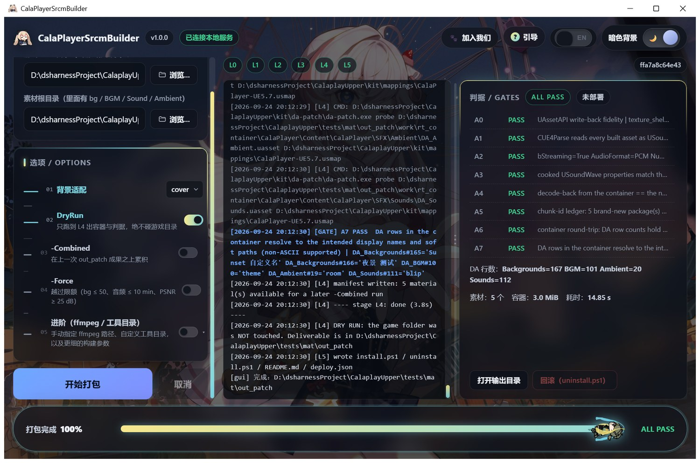](docs/images/ui-layout.jpg) | [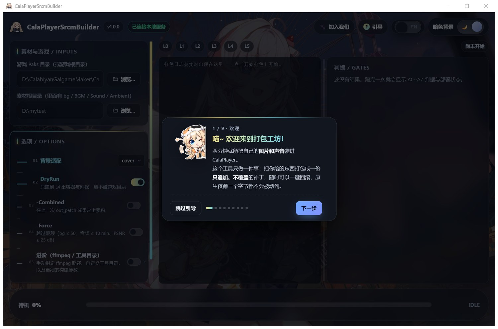](docs/images/guide.jpg) |

The progress bar runs with `chongci.gif` as its head:

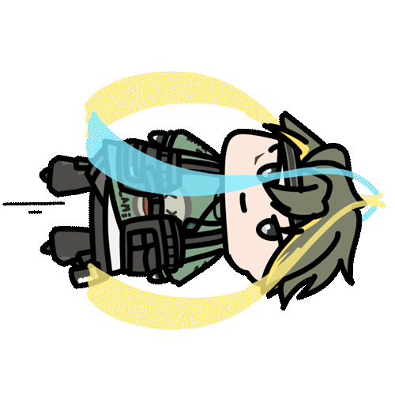

| Success dialog | Failure dialog with a one-click error-log export |
|---|---|
| [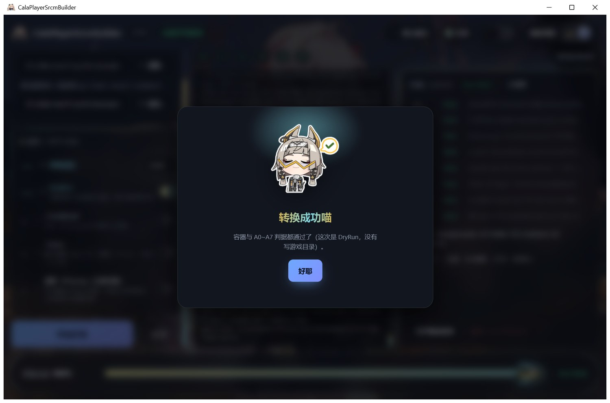](docs/images/modal-ok.jpg) | [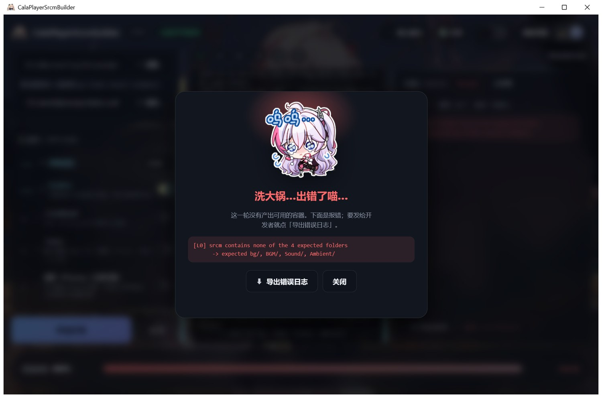](docs/images/modal-fail.jpg) |

---

## 1. 30-second quick start

```powershell
# 1) Prepare the material (folder names are case-insensitive; a missing one is skipped)
#    srcm\bg        images  (png/jpg/bmp/webp/tga/tif/gif)
#    srcm\BGM       music
#    srcm\Sound     sound effects
#    srcm\Ambient   ambience
#    srcm\names.json  optional: { "bg/city.jpg": "City Night" }

# 2) Run it
powershell -NoProfile -ExecutionPolicy Bypass -File .\build_srcm.ps1 `
    -Paks "D:\CalabiyanGalgameMaker\CalaPlayer" `
    -Srcm "D:\srcm"

# 3) The result lands in <parent of srcm>\out_patch\
#    CalaPlayer-Windows_P.{pak,ucas,utoc}   install.ps1  uninstall.ps1  README.md
#    verify\  _prev_container\  build.log  build_report.json
```

`-Paks` accepts the game root (`...\CalaPlayer`), a UE project root, the
`Content` dir or the `Paks` dir itself — the tool finds `Content\Paks` on its
own. **There is no hard-coded path anywhere in the code.**

### Switches

| Switch | Meaning |
|---|---|
| `-Fit cover` (default) | scale to fill 1920×1080 and crop the centre (for anime art, cropping beats black bars) |
| `-Fit contain` | scale to fit and pad with `(18,18,22)` bars; not a single pixel is resampled |
| `-DryRun` | run L0~L4 only (build the container + every gate); **never touches the game folder** |
| `-Combined` | **accumulate** on top of the previous `out_patch` build instead of rebuilding from the native tables. The carried state is `out_patch\work\manifest.json` plus the legacy tree next to it; **a failed run does not eat it**, and with no history it says `nothing to carry` outright |
| `-Force` | override the limits (bg ≤ 50, audio ≤ 10 min, PSNR ≥ 25 dB) |
| `-Ffmpeg <exe>` | explicit ffmpeg path |
| `-Kit <dir>` | explicit tool folder |

---

## 2. Safety ("the game folder must not be polluted")

| Measure | Implementation |
|---|---|
| Build and deploy are separate | L1~L4 only write `<srcm parent>\out_patch\`; **only L5 writes the game folder** |
| Back up before writing | L5 first **moves** the installed `_P` into `out_patch\_prev_container\` — that is the rollback material |
| Read back immediately | tex-inspect reads straight from the **real game folder**: audio `--audio-out` is byte-identical to the source, every background mip hash matches what we built, four DA row counts match |
| Auto-restore on failure | any of the above failing ⇒ the new container is deleted and `_prev_container` is restored, non-zero exit |
| Native resources | the sha256 of the 5 native containers is recorded at L0 and re-checked in the report; **they are never written** |
| Append only | the four DA tables are proven byte-by-byte to have "just more rows + a changed count field"; not one native row moves |
| Game is running | L0 probes read-only whether the installed `_P` is locked (= the game is running) ⇒ warning; the moment it would really write, it refuses with a message **before touching anything**; rollback only deletes files whose hash equals our own output |

> ⚠️ **Close the game first.** While it runs, `.ucas` is locked and the tool tells
> you `close the game first`, leaving the game folder exactly as it was.

---

## 3. Gates (A0~A7, all with on-disk evidence)

| Gate | Content |
|---|---|
| A0 | UAssetAPI write-back fidelity: both shell assets' uasset/uexp are byte-identical |
| A1 | CUE4Parse can read every new asset **from the container**, type = `USoundWave` |
| A2 | `bStreaming=True` / `AudioFormat="PCM"` / `NumChunks=1` / inline payload length == WAV length |
| A3 | the cooked `USoundWave`'s `NumChannels/SampleRate/Duration/TotalSamples` match the WAV |
| A4 | the WAV decoded back out of the container with `tex-inspect --audio-out` is **byte-identical** to the normalised WAV |
| A5 | chunk-id ledger: the new packages hit the native container **0 times**; the only allowed overlap is the deliberately overridden DA (count == expected) |
| A6 | unpack the delivered container **again**: four DA row counts correct + every new asset's uexp byte-identical |
| A7 | from the container, resolve each new row's **key / package name / asset name** FName index back to a string and compare against the display name and soft path we meant to write (**this gate is what protects non-ASCII dropdown names**; A6 only looks at row counts and asset bytes) |

Images additionally print `QUALITY: PSNR=… MAE=… 清晰度比=…` (below 25 dB is a
hard failure unless `-Force`) and drop `*_preview.png` into `out_patch\verify\`
for eyeballing.

---

## 4. Why it works this way

* **Container**: put a same-named patch container `CalaPlayer-Windows_P.{pak,ucas,utoc}`
  into `Content\Paks` (mount point `../../../`, only ExportBundleData +
  ContainerHeader, **no scriptobjects.bin**). Same-named containers are mutually
  exclusive, which is why `install.ps1` / `uninstall.ps1` come as a pair.
* **Backgrounds**: clone a native 1920×1080 `PF_DXT1` shell → `da-patch namerepl`
  changes the internal identity **in all three places** (`FolderName` + name-table
  package path + export ObjectName; changing only the file name makes the
  container register the old package id) → replace the 11 mip levels with the
  same-length payload using our own (bug-fixed) BC1 encoder.
* **Audio**: clone the smallest BINKA shell → keep the **streaming** path, swap
  `AudioFormat` to `"PCM"` and go **single-chunk inline**, with the payload being
  **the whole RIFF/WAVE file, untouched**; then fix the legacy uasset tail's Zen
  `BulkDataMap` `SerialSize` (without that the engine reads the payload at a stale
  length). Engine evidence: the runtime format-name table contains `PCM`, and
  `PcmAudioInfoHybrid` asserts `wFormatTag==1` and parses RIFF through
  `FWaveModInfo::ReadWaveInfo`.
* **MP3**: there is **no MP3 decoder at runtime** (the MP3 strings in the exe belong
  to the Media/Electra plugins and the editor importer), so everything is
  transcoded to PCM WAV first (`-ar 48000 -ac 2 -c:a pcm_s16le`).
* **DA append**: the background table is 34 B per row (`+30` is a **hard reference**
  to that row's preview material and **must be inherited from the clone source**;
  it merely *looks* like `-(row+2)`, and "maintaining" that as an invariant makes
  the engine `HandleBadImportIndex()` and go Fatal); the three audio tables are
  28 B per row through `da-patch sndmap` (it reflects `TMap.Add`).

---

## 5. Project structure (what every folder is for)

```
core/            the pipeline -- the only "engine". L0~L5 orchestration, the
                 A0~A7 gates, append-only DA writes, BC1, WAV normalisation,
                 kit/ffmpeg discovery, logging and the report.
                 ⛔ DO NOT CHANGE: touching this changes what the tool does.
cli/             command-line entry (a thin argparse shell over core).
                 ⛔ DO NOT CHANGE.
main.py          PyInstaller frozen entry (CLI).          ⛔ DO NOT CHANGE

gui/             the UI layer (a shell; it holds no packing logic):
  tasks.py         task registry + worker thread + CancelableLog (it feeds core's
                   log to SSE through Log.add_sink instead of a second pipeline)
  app.py           every FastAPI /api/* (token guard / SSE / native dialogs /
                   error-log export / allowed-link opener / clipboard / **prefs**)
  prefs.py         the handful of settings that must survive a restart (guide seen,
                   language, theme, split ratio).  Stored in
                   %LOCALAPPDATA%\CalaPlayerSrcmBuilder\prefs.json: the page gets a
                   fresh random port on every launch, so localStorage's origin moves
                   with it and nothing would be remembered.
  desktop.py       PyWebView shell + the whole --selftest suite + screenshots
  no_window.py     adds CREATE_NO_WINDOW to every child process (in-process patch,
                   core untouched)
  frontend/        Vue 3 sources (see "which file to edit" below)
  dist/            the vite output, shipped with the Kit (runs without Node)
  ✅ this layer is free to change.
gui_main.py      PyInstaller frozen entry (GUI -> CalaPlayerSrcmBuilderGUI.exe).

kit/             the self-contained tool set: retoc / da-patch / tex-inspect /
                 mappings(usmap) / native(oo2core, zlib-ng).  build_*.ps1 *copies*
                 it, so after changing tools-src you must re-run the build scripts.
tools-src/       C# sources for da-patch and tex-inspect (republishable with dotnet)
python/          the project venv (numpy / pillow / pyinstaller / pywebview / fastapi)
tests/           regression and sandbox:
  regression.py      the 21-scenario CLI regression (factory exe + fakegame sandbox
                     + a guard on the real game folder)
  run_regression.ps1 wrapper
  gui_api_check.py   GUI API end-to-end (G1)
  gui_exe_check.py   the three checks on the frozen GUI exe (G4)
  fakegame/          the sandbox game folder (5 hard-linked native containers plus
                     a copy of the installed _P)
  mat/               material generated by the regression (throw-away; re-running
                     the regression rebuilds it)
  srcm_*/            hand-made demo material
logs/            per-run self-test / regression logs and screenshots (evidence;
                 **not in git** — the ones the README uses are copied to docs/images/)
docs/            design notes (per-round assessments, cleanup plan)
  images/          the screenshots / animated gif / cat art used by this README
dist/            deliverables (two CLI Kits + two GUI Kits). **Not in git** — they go
                 out as Release assets
build_srcm.ps1   CLI wrapper        ⛔ DO NOT CHANGE
build_kit.ps1    builds the two CLI Kits
build_gui.ps1    builds the two GUI Kits (stage art -> vite build -> PyInstaller)
scripts/         maintenance: clean.ps1 (file tidying), check_dist.ps1 (deliverable
                 manifest check)
bg_light.jpg     light-theme background (copied into gui/frontend/public/ at build time)
bg_dark.jpg      dark-theme background (same)
.vscode/         recommended editor setup (extensions / settings / debug configs)
.gitignore       what stays out of the repo, and why
AGENTS.md        cross-session working rules + current state + trap table (for AI help)
README.md        the Chinese original (cross-linked at the top)
```

> **What the repository deliberately does NOT contain** (all in `.gitignore`): `python/`
> (the venv), `gui/frontend/node_modules/`, `gui/dist/` and `build_out/` (build output),
> `dist/` and `kit/` (deliverables and the self-contained tool chain — they ship as Release
> assets), `tests/mat/` and `tests/fakegame/` (regression material; **fakegame is hard-linked
> to the real game and contains the game's own data — it is never published**), and `logs/`.
> In other words a clone gives you the **source**, not a ready-to-run build: run §6, or just
> download a Release.

### 5.1 Which file to edit for a UI change

| What you want to change | File |
|---|---|
| Page skeleton, columns, log/gates divider, theme switch, test hook | `gui/frontend/src/App.vue` |
| Path inputs and "Browse…" | `gui/frontend/src/components/PathField.vue` |
| Options (Fit / DryRun / Combined / Force / Advanced) | `gui/frontend/src/components/OptionsPanel.vue` |
| The Line-Sidebar option list itself | `gui/frontend/src/components/LineSidebar.vue` |
| The zh/EN switch (ReactBits Squish Switch port) | `gui/frontend/src/components/SquishSwitch.vue` |
| The "background fit" dropdown (ReactBits Glide Select port) | `gui/frontend/src/components/GlideSelect.vue` |
| The text-decode ripple on a language switch | `gui/frontend/src/components/ScrambleText.vue` |
| Live log panel | `gui/frontend/src/components/LogView.vue` |
| A0~A7 gates panel (incl. BorderGlow) | `gui/frontend/src/components/ResultPanel.vue` |
| Draggable divider | `gui/frontend/src/components/SplitPane.vue` |
| Bottom progress bar | `gui/frontend/src/components/ProgressBar.vue` |
| Success / failure dialog | `gui/frontend/src/components/StatusModal.vue` |
| "Join us" community dialog | `gui/frontend/src/components/CommunityModal.vue` |
| First-run guide | `gui/frontend/src/components/Onboarding.vue` |
| Every UI string (zh + en) | `gui/frontend/src/i18n.js` |
| Settings remembered across launches (guide/language/theme/split) | `gui/frontend/src/prefs.js` + `gui/prefs.py` |
| Theme variables (light/dark palettes) | `gui/frontend/src/styles/theme.css` |
| Uiverse-style components (buttons/cards/fields/tables/scrollbars) | `gui/frontend/src/styles/uiverse/basic.css` |
| Progress / modal / glow / guide styles | `styles/uiverse/{progress,modal,border-glow,onboarding}.css` |
| Backend endpoints | `gui/app.py`; task thread and cancel | `gui/tasks.py` |
| Desktop shell, self-test assertions, screenshots | `gui/desktop.py` |
| UI art (png/gif/ico) | put it in `gui/frontend/public/` (`gui/dist/` also works as a drop folder; the build script moves it over) |

> ⚠️ `gui/dist/` is vite's output directory and **is wiped on every build**. Keep
> art you want to keep in `gui/frontend/public/`; anything dropped into
> `gui/dist/` is picked up by step 1 of `build_gui.ps1`.

---

## 6. Rebuilding

```powershell
# Rebuild both CLI Kits (exe + kit + README)
powershell -NoProfile -ExecutionPolicy Bypass -File .\build_kit.ps1
# Rebuild both GUI variants
powershell -NoProfile -ExecutionPolicy Bypass -File .\build_gui.ps1

# Re-publish the self-contained tools (only after changing tools-src C#)
#   --no-restore is MANDATORY: the csproj pins UAssetAPI as Version="*", so a
#   restore floats it to a new version, and the A0/A1 gates were only verified
#   against 1.1.0.  Both tools must be published, and because build_kit /
#   build_gui *copy* kit\, you have to re-run those as well.
#   dotnet publish tools-src\da-patch\da-patch.csproj -c Release -r win-x64 `
#       --self-contained true --no-restore -p:PublishSingleFile=true `
#       -p:EnableCompressionInSingleFile=true -p:PublishTrimmed=true -p:TrimMode=partial `
#       -p:PublishReadyToRun=true -o kit\da-patch
#   dotnet publish tools-src\tex-inspect\tex-inspect.csproj -c Release -r win-x64 `
#       --self-contained true --no-restore -p:PublishSingleFile=true `
#       -p:EnableCompressionInSingleFile=true -p:PublishTrimmed=true -p:TrimMode=partial `
#       -o kit\tex-inspect
#   The publish output contains .pdb files -- delete them before packing.
```

## 7. Sizes (2026-09-24, after the sixth GUI round)

| Piece | Size | Notes |
|---|---|---|
| `CalaPlayerSrcmBuilder.exe` | **25.6 MB** | PyInstaller onefile (Python + numpy + pillow) |
| `CalaPlayerSrcmBuilderGUI.exe` | **41.0 MB** | PyInstaller onefile --windowed (+ pywebview / fastapi / uvicorn / gui/dist) |
| `kit\da-patch\da-patch.exe` | **27.0 MB** | self-contained single file, **trim + ReadyToRun** |
| `kit\tex-inspect\tex-inspect.exe` | **19.2 MB** | self-contained single file, **trim only** |
| `kit\retoc` + `native` + `mappings` | 10.9 MB | retoc / oo2core / zlib-ng / usmap |
| **CLI minimal Kit** | **82.6 MB** | no ffmpeg (14 files: exe + README + `build_srcm.ps1` + `KIT_VARIANT.txt` + kit\) |
| **CLI full Kit** | **287.0 MB** | plus `kit\ffmpeg\ffmpeg.exe` (204 MB) |
| **GUI minimal Kit** | **98.1 MB** | 12 files (exe + README + the same kit) |
| **GUI full Kit** | **302.4 MB** | 13 files |

The deliverable manifest is enforced by `scripts\check_dist.ps1` (which file each
Kit is allowed to contain is written down in there).

## 8. What a full-size run costs (measured, 2026-09-23)

"Full" material = **50 backgrounds + 600 s (10 min) of audio**, 100.8 MB of source:

| Item | Measured |
|---|---|
| Time | **145 s** |
| Delivered container | `ucas` **170.1 MB** (58 packages / 59 chunks; `.pak` 347 B, `.utoc` ~3 KB) |
| Peak scratch disk | **about 1.5 GB** (all inside `<srcm parent>\out_patch\`; the native containers are hard links and cost nothing) |
| DA rows | `DA_Backgrounds` 165→**215**, `DA_BGM` 100→**102**, `DA_Ambient` 19→**20**, `DA_Sounds` 111→**112** |
| Quality | BC1 PSNR **41.5 ~ 43.1 dB** for the 50 images |
| Gates | A0~A7 all PASS (not deployed, `-DryRun`) |

Re-run it with `python tests\regression.py --stress` (not part of the default
suite because it takes 2.5 minutes).

> Make sure the drive holding `<srcm parent>` has **≥ 2 GB** free. The container
> grows by roughly 1.4 MB per background and 11.5 MB per minute of stereo audio.

## 9. Regression (run it after changing anything)

```powershell
powershell -NoProfile -ExecutionPolicy Bypass -File .\tests\run_regression.ps1
#   -> 21 scenarios, about 3 minutes, all through the "factory" exe + the fakegame
#      sandbox + a guard on the real game folder
#   --only T1 T6                 run selected scenarios
#   --list                       list them
#   --exe <exe>                  use another exe (e.g. the full Kit)
#   --kit <dir>                  use another kit (e.g. an experimental slimmer one)
#   --stress                     run only the full-size test (50 images + 10 min audio)
```

| Scenario | Assertion |
|---|---|
| T1 full dry run | A0~A7 all PASS, `deployed=false` |
| T2 deploy + read-back + rollback | the deployed container hash == the built one; after `uninstall.ps1` the sandbox is back to the pre-deploy state |
| T3 backgrounds only / T4 audio only | the other family's gates show `skipped`, no fake pass |
| T5 `-Fit contain` | the log mentions `borders` |
| T6 broken image / T12 empty material folder | non-zero exit + the expected message |
| T7 MP3 without ffmpeg | non-zero exit + the Chinese hint |
| T8 bg limit / T10 PSNR gate | non-zero exit (each hits its own limit) |
| T9 / T11 `-Force` | overrides the limit and the quality gate |
| T13 `-Combined` | `carried_materials` non-empty (accumulation works) |
| T14 container locked (= game running) | non-zero exit + "close the game first", **sandbox untouched** |
| T15 no ffmpeg at all | a compliant WAV still runs through and every gate passes (= the minimal Kit's promise) |
| T16 full Kit bundles ffmpeg | even with PATH probing disabled it falls back to `kit\ffmpeg\ffmpeg.exe` |
| T17 `-Kit <dir>` | the given tool folder is really used |
| T18 / T19 | with ffmpeg present an MP3 **is** transcoded; `-Ffmpeg <path>` also works |
| T20 `-Combined` with no history | says `nothing to carry` and the container only carries this run's srcm |
| T21 after a failed `-Combined` | the previous accumulation **survives** and the next `-Combined` still carries it |
| Throughout | the 5 native containers' hashes unchanged; the **real game folder** untouched |

> A read-only dry run against the **real** game folder was also done
> (`-Paks D:\CalabiyanGalgameMaker\CalaPlayer -DryRun`): 13.5 s, A0~A7 all PASS,
> and all 8 files in the real folder **byte-identical** afterwards (including the
> installed audio3 `_P`) — proof that hard-linking the 858 MB `ucas` into the work
> dir does not write through to the original.
>
> The regression also prints whether the sandbox is byte-identical to the real
> game folder (8 container files); if not it says `DRIFTED`, because conclusions
> drawn then may not describe the real machine.

Three **test-only** environment variables make the limits and the quality gate
reachable with tiny material (do not set them in normal use): `CALA_MAX_BG`,
`CALA_MAX_AUDIO_SECONDS`, `CALA_MIN_PSNR`; plus `CALA_NO_FFMPEG=1` to fake a
machine without ffmpeg.

## 10. Desktop UI (GUI, Vue 3 + FastAPI + PyWebView)

```powershell
python gui\desktop.py                 # open the window
python gui\desktop.py --headless      # HTTP API only (prints a token-protected URL)
python gui\desktop.py --selftest      # window -> page loaded -> page called the API -> exit code
```

* Backend = FastAPI on `127.0.0.1`, **loopback only**, with a per-run one-shot token
  (`?t=` or the `X-Cala-Token` header); `/api/*` without it is **403**.
* Front end = a Vue 3 single page (G2) served from `gui/dist`; the desktop shell is
  PyWebView (WebView2). `gui/dist` ships with the Kit, so a machine without Node can
  run it.
* **The packing logic is exactly the command-line one** — the GUI calls the same
  `core.builder.Builder`, so the A0~A7 gates, the deploy path, one-click rollback
  and `build.log` / `build_report.json` are identical end to end;
  `core/`, `cli/`, `main.py` and the two `build_*.ps1` are untouched.
* The "Roll back" button **calls the `uninstall.ps1` that is already sitting in the
  output folder** — there is no second rollback implementation in the GUI.
* "Cancel" lands on a log boundary between L0~L4; **once L5 (deploy) starts it is
  ignored**, so a run either finishes or rolls back, never a half-applied patch.

Endpoints: `GET /api/health` · `POST /api/start` · `GET /api/logs/{id}` (SSE live log +
stage events) · `GET /api/report/{id}` · `POST /api/cancel/{id}` ·
`GET /api/select_folder` · `GET /api/open_folder` · `POST /api/uninstall` ·
`POST /api/export_log/{id}` · `GET /api/open_url`. Only one build may run at a time
(anything else gets a 409).

Verification (G1, one command):

```powershell
python tests\gui_api_check.py
#   token 403 / a dry run over plain HTTP with the live log / gate verdicts identical
#   to the CLI / a real deploy + /api/uninstall rollback / cancel really stops it /
#   the real game folder untouched
```

### 10.1 Theme and backgrounds (two images cross-fading)

* Two images live in the project root: `bg_light.jpg` and `bg_dark.jpg`; the build
  copies them into `gui/frontend/public/` and they end up in `gui/dist`.
* Each is a **full-screen fixed layer** (`cover` + `center` + `no-repeat` + `fixed`)
  and they cross-fade by `opacity` (620 ms) — switching "dissolves" rather than cuts.
* The little switch at the top-right (Uiverse-style sliding pill with sun/moon
  cross-fade) flips between them, remembers the choice in `localStorage` and applies
  it before the first paint so there is no flash of the wrong theme.
* The **light** theme deliberately adds no dark scrim: it uses high-contrast dark ink
  and translucent white cards. The **dark** theme adds a translucent scrim
  (`rgba(5,7,12,.6)`) over the photo.
* Every style reads the same theme variables, so changing one colour moves both themes.

### 10.2 Front-end build and self-test

```powershell
cd gui\frontend
npm.cmd install          # once
npm.cmd run build        # output -> gui/dist (FastAPI serves it, PyInstaller ships it)

# back in the project root, verify the whole UI with one command:
python gui\desktop.py --selftest --selftest-ui
#   -> window loaded / Vue mounted / the page reached /api/health / token guard /
#      the light and dark layers really point at bg_light.jpg and bg_dark.jpg and
#      swap with the theme / **fill the form from the page, press Start, wait for it
#      to finish and assert A0~A7 are all PASS**
```

The page deliberately exposes an automation hook (the self-test and batch scripts use
it; it works headless too):

```js
window.__cala.setParams({ paks: '...', srcm: '...', dryRun: true })
window.__cala.run()
window.__cala.state()      // { running, ok, deployed, gates, da_counts, lang, ... }
window.__cala.toggleTheme()
window.__cala.setLang('en')   // 'zh' | 'en' - instant, whole page
```

### 10.3 Desktop shell: native folder dialog and window sizing

* "Browse…" goes through `/api/select_folder` to pywebview's native folder picker
  (Vista IFileDialog). It **opens at the path already typed in** (falling back to the
  user's home when that is not a directory).
* A failing dialog **reports the reason into the UI** instead of silently doing
  nothing — that matters: pywebview 6 turned the module-level `FOLDER_DIALOG`
  constant into a **deprecated function**, and passing it as `dialog_type` makes
  `create_file_dialog` fall into an `except` that swallows the exception and returns
  `None` immediately, **indistinguishable from "the user cancelled"** (this was a real
  bug found by the self-test). The fix uses `webview.FileDialog.FOLDER`, and the
  pywebview logger is captured — any exception becomes a 500.
* The window minimum is `960×620` and keeps two columns even at that size (left 400 px)
  with a log area ≥ 360 px; the single-column fallback only appears in a narrower
  browser window.

### 10.4 Desktop shell self-test (G3)

```powershell
python gui\desktop.py --selftest --selftest-shell
#   -> the layout keeps two columns and a tall-enough log at 1226x783 / 946x583 (min) / 1226x783;
#      the native folder dialog: **located by window class #32770** to prove it really
#      appeared, then WM_CLOSE, and asserted that the call really blocked (>=1.5s)
```

### 10.5 The frozen exe self-test (G4) and two bugs that only appear once packed

```powershell
python tests\gui_exe_check.py            # the newest GUI Kit in dist by default
python tests\gui_exe_check.py --keep-log # keep the exe's full log in logs/ on failure
```

Three checks, in the order a user meets them:

1. **Double-click**: launch with `ShellExecuteW` (**exactly what Explorer does**: no
   std handles), require a real top-level window owned by that exe that answers
   `WM_NULL`, and **never** a PyInstaller "Unhandled exception in script" modal.
2. **No-console startup**: launch `--headless --selftest` the same way and require the
   HTTP API to come up (the regression test for bug ① below — launching through
   `subprocess` inherits valid handles and **hides** it).
3. **Frozen self-test**: `--selftest --selftest-ui --selftest-shell --log-file`, assert
   exit code 0, Vue really mounted, the native dialog really appeared and
   **a build driven from the page has all A0~A7 PASS**.

Two bugs (both appear only after packing; the source mode is green either way):

* **① `sys.stdout is None` kills uvicorn.** A `--windowed` exe double-clicked from
  Explorer has **no** stdout/stderr; uvicorn's log formatter calls
  `sys.stdout.isatty()` → `AttributeError` → `Unable to configure formatter 'default'`
  → uvicorn never starts, the window never appears and all you get is a modal crash
  box. Fix: `ensure_std_streams()` in `gui/app.py` (installs a dummy stream whose
  `isatty()` is `False`), called at the top of `start_server_thread()` /
  `run_server()` and the desktop shell's `main()`.
* **② Without a console, .NET writes stdout in the ANSI code page.** `core/common.py`
  always decodes child output as **UTF-8**, but `da-patch` / `tex-inspect` did not set
  an output encoding: **with a console .NET writes UTF-8, without one it falls back to
  ANSI (GBK here)**. So `自定义名` (GBK `D7 D4 B6 A8 D2 E5 C3 FB`) decoded as
  `\ufffd\u0536\ufffd…` and gate A7 failed the build — while the CLI version (a console
  program, with a console) and source mode were green, which is why it only showed up
  with **a double-clicked GUI exe + a non-ASCII material name**. Fix: `ForceUtf8Stdio()`
  at the top of both `tools-src/*/Program.cs`. The same fix also protects "the CLI
  launched by a console-less host (task scheduler / service / `CREATE_NO_WINDOW`)".

With CJK material names, ② is a **must-fix**: without it the GUI fails on install.

### 10.6 UI/UX round (layout / black boxes / Uiverse / progress bar / dialogs)

Six things the user asked for after seeing the real screen; all landed and are locked
down by the self-test:

1. **Layout and adaptivity (bug level)**
   * The shell is a flex column (header / work area / progress bar) and the work area is
     a `grid`: left column `clamp(330px, 30%, 460px)`, right `minmax(0,1fr)`; at
     946×583 → 1446×903 the log height goes 293 → 613 px (the self-test asserts "a taller
     window must give a taller log").
   * The log panel **scrolls itself** (`overflow-y:auto` + themed scrollbar) and follows
     the tail while stuck to the bottom. A real bug was fixed here: when a run finishes
     the 判据 panel grows and pushes the log out of view (previously it only followed new
     lines) ⇒ a `ResizeObserver` re-pins on resize too. The self-test asserts
     `scrollHeight > clientHeight` and `atBottom=True`.
2. **Child-process black boxes**: `gui/no_window.py` patches `subprocess.Popen.__init__`
   in-process to add `CREATE_NO_WINDOW` to every child (**`core/common.py` untouched**).
   The check is not "the flag was set": in the **console-less** exe the self-test does
   `AttachConsole(child)` and asks **the child itself** whether it owns a console window
   ⇒ `0` with the patch, a real HWND with the patch removed (positive control).
3. **Uiverse visuals**: the theme switch and the labels sit in **solid, shadowed chips**
   (before, they were straight on the photo and unreadable); INPUTS / OPTIONS / gates
   became cards with a **hover gradient ring + lift** (`.uv-card-glow`, gold→cyan, the
   same palette as the progress bar); the log and the left column get themed scrollbars.
4. **Bottom progress bar**: `ProgressBar.vue`, `--p` advances with the stage (L0→L5) and
   tops out at the end; the head is `chongci.gif` itself, and the colours come straight
   from the GIF palette (**cream-gold `#F7E78D` / cyan `#7DD7E4`**) so the animation looks
   grown into the bar; it has a travelling sheen and a slight bob while running.
5. **Success / failure dialogs**: `success.png` + 「转换成功喵」 / `cry.png` +
   「洗大锅...出错了喵...」, Uiverse-style blur + scale fade. **Only the failure one has
   「⬇ 导出错误日志」**. Clicking the backdrop closes them, but **only a real click**
   (`isTrusted`) — otherwise a synthetic click pumped by the host message loop makes the
   result popup vanish by itself (a real bug this round, found only through the modal's
   own breadcrumb trace).
6. **Export error log**: `POST /api/export_log/{id}` uses the same pywebview native
   dialog machinery as `/api/select_folder` (`FileDialog.SAVE`) to save `<task>.log`,
   containing a header + the whole SSE log + the on-disk `build.log` /
   `build_report.json`; with nothing to export it answers
   `{"ok":false,"reason":"empty"}` (the wording shown is chosen by the page, so it follows
   the UI language) instead of erroring. Tests pass `?path=` to write straight there.
7. **Application icon**: `gui/dist/T_UI.png` → a multi-size `T_UI.ico` is generated at
   build time (`System.Drawing.Icon` cannot read PNG) and used both as the PyWebView
   window icon (`webview.start(icon=...)`) and the exe icon (`--icon`).

Two more "a deliverable must not grow litter" measures: the GUI process chdirs to
`%LOCALAPPDATA%\CalaPlayerSrcmBuilder` on start (a double-clicked exe has CWD = its own
folder, and when the srcm folder is wrong core's fallback writes `build.log` into the CWD
⇒ no more stray files next to the exe; kit / ffmpeg discovery is exe / `_MEIPASS` based and
does not care about the CWD), `build_gui.ps1` clears `build.log` / `build_report.json` /
`.pdb` that sneak into the kit, and `tests/gui_exe_check.py` asserts "the self-test left
no extra file in the delivered folder".

### 10.7 GUI round 3 (divider / first-run guide / card motion / a bigger progress head)

1. **Log and gates side by side with a draggable divider**
   * The right column went from "stacked" to `SplitPane`: live log on the left, A0~A7
     gates on the right, **50/50 by default**, drag to resize, **double-click to centre**,
     arrow keys to nudge. The position is kept in `localStorage` (`cala-split`).
   * The gates panel **scrolls internally** (`overflow-y:auto` + themed scrollbar): the
     header and the footer buttons stay put while the middle scrolls, so a long list can
     no longer push the panel out of the window.
   * Both sides are pure flex (no hard-coded pixel heights) and follow the window; from
     946×583 to 1446×903 the log goes 366 → 686 px.
   * The self-test does not settle for "the divider exists": it **dispatches real
     pointerdown/move/up events**, asserts pane A really widened (358 → 505 px) and that
     the reset returns to 50/50.

2. **First-run guide (a stepped walkthrough)**
   * Nine steps: `hello.png` welcome → seven `guide.png` steps (paths / DryRun / -Force /
     Advanced / Start / log-vs-gates / Join us) → `end.png`.
   * The mask is not a flat black layer but a **spotlight**: a box following the target
     element dims everything around it via `box-shadow: 0 0 0 9999px`, so each step points
     at the control it talks about, and the box is recomputed on resize.
   * The **`? Guide`** button replays it any time; `Skip guide` / `Esc` end it; seeing it
     once is remembered in `localStorage` (`cala-onboarded`).
   * During the walk the target is scrolled into view first (the left column scrolls), so
     the spotlight is never on something off-screen.
   * The self-test walks every step and asserts: the first is `hello.png` with no
     spotlight, the middle ones are all `guide.png`, the last is `end.png`, the spotlight
     box matches the target rectangle **coordinate by coordinate (±3px)**, the card is
     **really visible** (`visibility` / `opacity` / size > 0 / fully inside the viewport),
     and finishing really closes it and remembers the choice.
   * ⚠️ That "really visible" check was added late: the component first hit the
     `<script setup>` template-ref trap (the template said `ref="card"` while the variable
     was `cardRef` ⇒ the ref stayed `null`), so `layout()` returned early and the card sat
     at `(0,0)` with `visibility:hidden` — **the spotlight showed but the card never did,
     while the old assertions (".uv-ob-art exists and the image decoded") were all green**.
     The screenshot caught it first; only then did the geometry/visibility assertions
     follow. Do not stop at "the element exists".

3. **Card motion**
   * The `OPTIONS` card gets a gold→cyan **comet circling its border** (`@property` driving
     a conic gradient), faster while building, plus a hover lift.
   * The `GATES` panel gets **ReactBits' BorderGlow**
     ([component](https://www.reactbits.dev/components/border-glow)): a glow that
     **follows the pointer** along the border (`--gx/--gy` with a mask keeping only the
     1.6 px ring). Upstream ships it as React + framer-motion; this project has no React, so
     the same look is reproduced in **plain CSS** with no new dependency.

4. **The `chongci.gif` head on the progress bar**
   * Round 3 enlarged both the head (34 → **68 px**) and the rail (12 → 20 px). Round 4
     puts the **rail back to the original 12 px** while keeping the magnified head, and the
     self-test asserts the head is **exactly centered**: its measured centre equals the
     rail's centre equals the bar's centre (729 / 729 / 729 in the check).

5. **Screenshot evidence**: `logs/gui_shot_{guide,layout,ok,fail,en,ls,join}.png`.
   Captures go through **`PrintWindow(hwnd, memDC, PW_RENDERFULLCONTENT)`**, i.e. the window
   renders itself into a memory DC, so **no other window can occlude it**; the fallback is
   `ImageGrab` + a temporary topmost. The return value carries a `[printwindow]` /
   `[screengrab]` marker so you can see how a picture was taken (chasing z-order with
   `SetForegroundWindow` / topmost lost to an app that keeps re-raising itself: three shots
   in a row caught the user's chat window).

### 10.8 GUI round 4 (bilingual / more guide steps / Line Sidebar / community dialog)

1. **The whole UI is bilingual (zh + en)**
   * Every string lives in `gui/frontend/src/i18n.js` (one flat key space, two
     dictionaries). `lang` is a plain Vue ref, so switching re-renders the templates
     instantly — no reload, no event bus.
   * Language detection on first run: `localStorage` (an explicit choice) → otherwise the
     system locale (`zh*` → Chinese, anything else → English). It is applied in `main.js`
     **before the first render**, so there is never a frame in the wrong language.
   * The **中 / EN** segmented switch sits at the top-right; `window.__cala.setLang('en')`
     is the automation equivalent.
   * The first-run guide, both result dialogs and the community dialog are all translated,
     and the "nothing to export" / "cancelled" wording is now chosen on the page from the
     backend's machine-readable `reason`.
   * Strings that come from the **frozen core** (build log lines, gate details, build
     errors) are intentionally **not** translated: they are emitted by `core/builder.py`
     and a translation table for them would rot the moment the pipeline adds a message.
   * The self-test reads a fixed sample of visible strings in Chinese, switches to English,
     asserts **every sample changed** and that the English ones carry no CJK, then switches
     back and asserts the Chinese copy is restored.

2. **Two more guide steps** (so the walkthrough covers every control):
   * **-Force**: "when the material exceeds the defaults (bg > 50 or audio > 10 min) or the
     quality lands under 25 dB PSNR, tick -Force to continue" — it is a confirmation, not a
     speed switch.
   * **Advanced**: "set an explicit ffmpeg path, point at your own kit folder, and read the
     finer build switches".

3. **The options list is now ReactBits' [Line Sidebar](https://www.reactbits.dev/components/line-sidebar)**
   * Ported to Vue with the mechanism kept verbatim: a single `rAF` loop eases a per-row
     `--effect` (0..1) with frame-rate independent exponential smoothing, and every derived
     property reads that one value — `translateX` slides the row towards the cursor,
     `color-mix()` blends the text colour into the gold/cyan accent, and the marker line's
     scale follows along. Because it is one shared value there are no staggered CSS
     transitions.
   * Rows whose toggle is ON (and the expanded Advanced row, and the always-valued fit row)
     are pinned at full effect, so "what is active" is readable at a glance.
   * The proximity curve defaults to ReactBits' `smooth` falloff; centres are measured with
     `getBoundingClientRect` (immune to whatever the offsetParent is — the React original
     uses `offsetTop`, which is only equivalent when the nav itself is the offsetParent).
   * The self-test pokes the pointer at one row with a synthetic `pointermove`, waits for the
     easing to settle and asserts the row under the cursor has `--effect > 0.75` and has
     **shifted ≥ 6 px**, a row two away stays under `0.25` and under 3 px, and the two have
     **different computed colours** (i.e. the gradient really follows the cursor). A
     positive-control style assertion, not "the component is mounted".

4. **"Join us" community dialog**
   * A `🐾 Join us` button in the header opens a modal with
     `gui/dist/joinus.png`, a piece of CalabiYau-style cat-speak (`喵言喵语`) and two
     buttons.
   * **Discord** → `https://discord.com/invite/BGeYfMBwaw/login`; **Bilibili** is a
     placeholder (`#`) that says `链接还没放上来喵` instead of doing nothing.
   * Links are opened through `GET /api/open_url`: inside WebView2 a plain
     `<a target="_blank">` can simply be swallowed by the host, which looks exactly like a
     dead button, so the backend hands the URL to `webbrowser.open` instead. The endpoint
     only accepts a short allow-list (the Discord invite and bilibili.com) so it can never
     become an "open anything" primitive, and `dry=1` validates without launching anything
     (which is what the self-test uses — it must not pop a browser).
   * Open/close animation is the same Uiverse machinery as the result dialogs (backdrop
     fade + spring scale-in), with a gold→cyan halo and a close ✕.
   * The self-test asserts the dialog opens, shows `joinus.png` (decoded, wider than 120 px),
     the buttons point where they should, the title keeps the cat voice, the entrance
     animation is present, the Bilibili placeholder says something, and `closeJoin()`
     dismisses it.

5. **English README**: this file. `README.md` is the Chinese original; both cross-link at
   the top so GitHub visitors land in the right language.

### 10.9 GUI round 5 (Squish Switch / decode ripple / Glide Select / four community entries)

1. **The 中/EN switch is now ReactBits' [Squish Switch](https://www.reactbits.dev/micro/squish-switch)**
   * `SquishSwitch.vue` keeps the original mechanism: the knob is driven by a **real spring
     integrator** (not a CSS transition) and the spring's **velocity** drives the shape —
     it stretches along the travel axis and squashes on the other one. That is the squish.
     Hovering swells it slightly, and after a 4 px slop you can drag it to toggle.
   * The self-test performs a **real press** (pointerdown + pointerup — it commits on
     pointerup, so a synthetic `.click()` does nothing) and then **samples the knob's
     transform every 45 ms, 17 times**: it asserts `|scaleX − 1| > 0.02` and
     `minSy < 0.999` (it really stretched *and* squashed — not merely "it moved"), that the
     knob ends at the far end and that the language really changed.

2. **The one-shot "decode" ripple when the language changes**
   * Upstream [Scrambled Text](https://www.reactbits.dev/text-animations/scrambled-text)
     triggers on **pointer proximity**; the user explicitly did **not** want that. So
     `ScrambleText.vue` plays a **single decode wave when the switch is pressed**: every
     character starts as noise and settles in order of its **distance from the click
     point** (the "click ripple"), then it stops. Hovering afterwards never re-triggers it —
     only the next language switch does.
   * The noise glyphs are chosen **per script** (CJK → a random CJK character, Latin → a
     random letter), so each character keeps roughly its own advance width and a line never
     reflows while it scrambles. 23 text nodes are covered today (the three card titles,
     the path labels and "Browse…", the five option titles and hints, start/cancel, the
     empty-log text, the progress caption, and the two header buttons plus the theme label).
   * The self-test samples a **time series inside the page** every 60 ms (a cross-process
     `evaluate_js` round trip costs more than the wave lasts, so reading it from Python can
     only ever see the settled end): it asserts that at least one sample has `running > 0`
     with `#run` showing neither language, that the series ends on the settled English text,
     and that after 5 dispatched pointermove events `running` **stays 0** (proving hover does
     not trigger it).
   * ⚠️ That assertion immediately caught a real bug: the component used `nextTick` without
     importing it, so the async watcher threw a ReferenceError that Vue swallowed ⇒ the text
     swapped **instantly and the ripple never ran** — while assertions like "the copy is
     correct after the switch" stayed perfectly green. **Only the time series could see it.**

3. **The "background fit" dropdown is now ReactBits' [Glide Select](https://www.reactbits.dev/micro/glide-select)**
   * `GlideSelect.vue`: the popup holds a single "pill" element that **glides** between rows
     (`translateY(row × step)`), with a pop scale in/out, pointer scrubbing, arrow/Home/End/
     typeahead keys, a top/bottom flip when there is no room, and a small blur-swap on the
     label when the value changes.
   * The self-test presses it open, checks the pill sits on row 0, dispatches `pointerover`
     on row 1, asserts the pill **moved ≥ 20 px**, then scrubs and asserts the value became
     `contain`, the trigger label followed and the menu closed.

4. **"Join us" grew from two entries to four**
   * **GitHub**: the icon sits in a field of **stars flying everywhere** (9 of them, each with
     its own direction/rhythm/delay, an infinite CSS `gh-fly` animation). Clicking opens
     `https://github.com/killa0132/CalaplayUpper` **and** pops the `star.png` "leave me a
     star" dialog — a **vertical stack**, art on top and cat-speak below, with
     "Go leave a star / Next time, meow".
   * **QQ**: clicking **first copies the group number `1054243070` to the clipboard** and then
     shows a dialog with `joinQQ.png`, the number, the "Come on! Get patched up back in the
     cat nest!" copy and a "Copy it again" button.
   * The clipboard goes through the backend's `GET /api/copy`: inside WebView2
     `navigator.clipboard` needs a secure context **and** a user gesture, and when either is
     missing it **fails silently** — which would be another dead button. The endpoint only
     accepts ≤256 characters of text, and `dry=1` validates without writing. The self-test
     **really writes it and reads it back through Win32 `GetClipboardData`**, and it **saves
     whatever the user had on the clipboard first and puts it back afterwards** (the test
     must not disturb what is on their desktop).
   * `GET /api/open_url`'s allow-list gained the GitHub repository (alongside Discord and
     bilibili).
   * All three dialogs (hub / star / QQ) share the same Uiverse enter/exit animation:
     backdrop fade plus a spring scale-in.

5. **New screenshot evidence**: `gui_shot_{scramble,squish,glide,star,qq}.png`.

### 10.10 GUI round 6 (guide only once / community bar rebuilt / dropdown click-through / fixed left column)

1. **"The guide only opens by itself on the first run" used to be broken — and the root cause
   was not how `localStorage` was written, it was that the page has no stable origin.**
   * The page is loaded from `http://127.0.0.1:<random port>/` (a random port keeps other local
     programs from guessing it), and WebView2 buckets `localStorage` **by origin — including the
     port** ⇒ every launch is a brand-new empty bucket: `cala-onboarded`, `cala-lang`,
     `cala-theme` and `cala-split` all silently fell back to their defaults and the guide
     **popped up every single time**.
   * They now live in `%LOCALAPPDATA%\CalaPlayerSrcmBuilder\prefs.json` (new `gui/prefs.py` +
     `GET/POST /api/prefs`; allow-listed keys, values capped at 64 chars, atomic
     tmp + `os.replace`). `src/prefs.js` is awaited **before the app is mounted** in `main.js`,
     so every later read is synchronous (the theme and language must land on the **first
     frame**); `localStorage` is still written alongside it so `npm run dev` and a plain
     browser keep working.
   * The self-test **proves it end to end**: `prefs.clear(['cala-onboarded'])` before the window
     is created produces a genuine first run ⇒ the guide must come up **by itself** (not via
     `restart(0)`); after walking it, `GET /api/prefs` must show `cala-onboarded=1`; finally the
     page is **really reloaded** (`location.reload()` — that *is* the next launch) ⇒ the fresh
     page reports `guide=False, auto=False`. The user's own settings are written back afterwards
     (the same rule as the clipboard).
   * The card itself got three fixes: a `max-height` + vertical scroll (so a long step is still
     fully readable), a footer with `flex-wrap: nowrap` and `flex: none; white-space: nowrap`
     buttons (so "Skip guide / nine dots / Back / Next" **fits on one row** instead of wrapping
     and squeezing; the card also grew from 392 to 436 px), and a spotlight that **degrades to
     the visible intersection** instead of being drawn off-screen — and that only scrolls a
     genuinely scrollable ancestor, never `scrollIntoView` on the `overflow: hidden` right pane.

2. **Community dialog rebuilt**
   * The GitHub icon is now the **Octicon `mark-github`** path the user pasted (the self-test
     asserts the path prefix `M10.226 17.284c-2.965-.36-5.054`, not merely "there is an icon").
   * The four entries (Discord / Bilibili / GitHub / QQ) are **one 2×2 grid** with four equally
     sized buttons; it used to be a flex-wrap row that pushed QQ onto a line of its own.
   * **Hovering no longer drags a scrollbar out of the dialog.** The nine flying stars are
     absolutely positioned children, and those enlarge an ancestor's *scrollable overflow* —
     which is exactly why the bar appeared. The flight radius is now 13–28 px and the dialog has
     `overflow-x: hidden`; the self-test compares `scrollWidth`/`clientWidth` and
     `scrollHeight`/`clientHeight`, **before and after hovering**.

3. **Clicking "背景适配" > contain actually hit DryRun — z-index / click-through**
   * The cause was **stacking context**: the popup used to render inside the options card, the
     card has a `backdrop-filter` (which creates a stacking context) and every row carries a
     `z-index`, so the menu was **painted behind the next row** and clicks landed on DryRun.
     The fix is `<Teleport to="body">` + `position: fixed`, with `place()` anchoring it to the
     trigger's live position (re-anchoring on scroll/resize, and the outside-click test has to
     accept a menu that is no longer a child).
   * ⚠️ Teleporting exposed a second, subtler bug: the `--gs-*` custom properties were only set
     on the `.uv-gs` root, so the body-level popup **no longer inherited them** ⇒ row height and
     pill height fell back to `auto` ⇒ "the pill glides to row N" and "the pointer is on row N"
     used two different metrics and the pick landed one row off. The variables now ride on both
     elements.
   * The gate can no longer be "did the menu open": the self-test asks the browser with
     `document.elementFromPoint(row centre)` **what is actually painted there** and requires that
     row's `.uv-gs-opt`; it also asserts `position=fixed` and a `BODY` parent. The component keeps
     a `window.__calaGsTrace` breadcrumb (open/down/up/pick/close) so "the menu closed but nothing
     was picked" can be diagnosed at a glance.

4. **The squeezed "Browse…" button and the shrinking left column**
   * The button was a flexible flex item, so a long path squashed it to a sliver. It is now a
     folder SVG plus the label, with `flex: none; white-space: nowrap`; and the label no longer
     wraps (`ScrambleText` gained a `nowrap` switch, because its own `white-space: pre-wrap`
     overrides anything inherited).
   * The left column width is fixed exactly as requested: `grid-template-columns:
     clamp(330px, 30%, 460px)` is unchanged and the column gained
     **`scrollbar-gutter: stable`** — previously the moment the content grew a scrollbar the
     cards lost 11 px ("the column shrinks a bit after loading"). The self-test appends a
     1400 px element to force overflow and asserts the `#card-inputs` width is identical
     **before / after overflow / after removal**.
   * Those 11 px had made the "背景适配" label wrap onto two lines, so option rows now keep the
     title on one line and let the right-hand control give way first, with an assertion that the
     label is neither wrapped nor ellipsized (`scrollWidth <= clientWidth`).

5. **New screenshot evidence**: `gui_shot_second.png` (second launch: the guide does not
   reopen), `gui_shot_join_hover.png` (the 2×2 grid, hovered, with no scrollbar) and
   `gui_shot_layout_min.png` (the whole layout at the minimum window size).

6. **The right side adapted badly at small AND large windows — a colliding CSS class name**
   * Symptom: the right column's content occupied only its left part and floated in the middle
     (the gates card was squeezed to a few dozen pixels), and the wider the window the emptier
     it looked — at 1446 px the divider was still only 717 px wide instead of 976 px.
   * Cause: the `.right { display:flex; align-items:center; flex-wrap:wrap }` rule written for
     the **header's button group** also matched the **work area's second column**
     (`<section class="col right">`) — so that column got `align-items: center` (its children
     stopped stretching, so the SplitPane became shrink-to-fit and centred) plus
     `flex-wrap: wrap`. **It is the same mistake as round 5's `.uv-ss-face.left` colliding with
     `document.querySelector('.left')`**: one generic class name shared by two places.
   * Fix: the header group is now `.bar-right` (one place in the template, one in the styles).
     At every size the split is exactly as wide as the column, its first pane is flush with the
     column's left edge, the panes are equal, and the chips row (with the task pill) reaches the
     column's right edge.
   * Alongside it, the "background fit" trigger now shows only the **short value**
     (`cover` / `contain`; the explanation stays in the opened menu) — the old 198 px label
     squeezed the row title into an ellipsis in the minimum window (330 px column).
   * New gates (measured at all four window sizes by `--selftest-shell`): `splitW == rightW`,
     `paneAL == column left`, `paneA == paneB`, the gates card stays inside the column, the
     chips/task pill end at the column's right edge, **the panes at the large size must be at
     least 20 px wider than at the standard size** (it really does adapt), and at the minimum
     size `no option label is wrapped or truncated` (`trunc=0/5`).

## 11. Known limits (accepted for v1)

* The **thumbnail** of a newly added background in the in-game editor still shows the
  original tile (thumbnails go `@30` → MI → the shared atlas `T_BackgroundPreviews`, which a
  static patch cannot reach); the **large preview and PLAY are correct**. This is the v1
  behaviour the author accepted.
* PCM is uncompressed: 48 kHz stereo ≈ 11.5 MB per minute, mono ≈ 5.8 MB per minute.
* No OGG/Vorbis compression route (the engine does have a `VorbisAudioDecoder`; that is
  future work).
* No "replace a native entry" (v1 appends only).

---

## 12. Development and debugging guide

### 12.1 Two processes: start the backend first

The UI is two halves: the **page** (Vue; either the vite dev server or the built
`gui/dist`) and the **backend** (FastAPI; the real work is still `core/`). During
development both run:

```powershell
# terminal 1 -- backend (--dev pins port 8756 so vite can proxy /api to it, and turns
#               the WebView2 DevTools on)
python gui_main.py --dev

#   ... or no window at all, just the HTTP API (recommended: drive the front end in a browser)
python gui_main.py --headless
#   it prints http://127.0.0.1:<port>/?t=<one-shot token>; without the token /api/* is 403

# terminal 2 -- front-end dev server (hot reload)
cd gui\frontend
npm.cmd install        # once
npm.cmd run dev        # http://127.0.0.1:5173
```

* In `--dev` the backend pins its port to **8756** (`gui/desktop.py::DEV_PORT`) and
  `vite.config.js` proxies `/api` there, so the page needs no CORS and does not have to
  know the real port. To change it: `$env:CALA_API='http://127.0.0.1:9000'` before
  `npm.cmd run dev`.
* To debug in a **browser** instead of the embedded window: run
  `python gui_main.py --headless` and append the printed `?t=<token>` to
  `http://127.0.0.1:5173/` — a wrong token simply cannot reach the backend.
* `npm.ps1` is blocked by this machine's PowerShell execution policy, so **always use
  `npm.cmd`**.
* To produce the real artefact: `npm.cmd run build` (goes to `gui/dist`, which FastAPI
  serves and PyInstaller ships).

### 12.2 Opening DevTools

| Case | How |
|---|---|
| Embedded window (pywebview / WebView2) | `python gui_main.py --dev` (= `webview.start(debug=True)`), then press **F12** or **Ctrl+Shift+I** in the window (right-click → Inspect also works) |
| Browser | F12 |
| Backend log | that terminal; `--log-file x.txt` additionally writes a UTF-8 copy (the only option for a console-less exe) |

The page also exposes a deliberately public automation hook (the self-test and batch
scripts use it; it works headless):

```js
window.__cala.setParams({ paks:'D:\\CalabiyanGalgameMaker\\CalaPlayer', srcm:'D:\\srcm', dryRun:true })
window.__cala.run()               // one packing run (exactly the button's path)
window.__cala.state()             // { running, ok, deployed, gates, da_counts, split, lang, guide, join, ... }
window.__cala.cancel()            // stage-boundary cancel
window.__cala.toggleTheme()
window.__cala.setLang('en')       // instant whole-page language switch
window.__cala.setSplit(35)        // divider position (%)
window.__cala.openJoin()          // community dialog: openJoin/closeJoin/joinState
window.__cala.onboard.state()     // guide: state/next/prev/skip/restart(from)
window.__calaErrors               // every uncaught page error (essential for "a component
                                  // silently disappeared")
window.__calaModalTrace           // open/close breadcrumbs of the result dialog
```

### 12.3 The verification order after changing code

```powershell
# 0) if you touched a .py, check the syntax first.  PyInstaller does NOT fail on an
#    entry module with a syntax error: it skips the dependencies, prints "Build complete"
#    and hands you a noticeably smaller broken exe.
python -m py_compile gui\desktop.py

# 1) source self-test: Vue mounted / both themes / the 9 guide steps / layout and the
#    divider drag / the native folder dialog / language switch / Line Sidebar / the
#    community dialog / a real build driven from the page (A0~A7 must all PASS)
python gui\desktop.py --selftest --selftest-ui --selftest-shell

# 2) API layer (G1): token 403 / SSE / gate verdicts identical to the CLI / a real
#    deploy + rollback / cancel
python tests\gui_api_check.py

# 3) the 21-scenario CLI regression (about 3 minutes, factory exe + fakegame sandbox +
#    a guard on the real game folder)
powershell -NoProfile -ExecutionPolicy Bypass -File .\tests\run_regression.ps1

# 4) repack the deliverables + verify the frozen exe (G4: double-click / no-console
#    startup / frozen self-test)
powershell -NoProfile -ExecutionPolicy Bypass -File .\build_gui.ps1
python tests\gui_exe_check.py --keep-log
```

* **If you changed the C# in `tools-src/`** you must re-publish them self-contained (see
  section 6) and then **re-run `build_kit.ps1` and `build_gui.ps1`** — those scripts
  **copy** `kit\` into `dist\`.
* UI art (png/gif) goes into `gui/frontend/public/`; dropping it into `gui/dist/` also
  works, step 1 of `build_gui.ps1` moves it over (vite wipes `gui/dist/` on every build).
* The self-test leaves evidence in `logs/`: `gui_shot_guide.png` (the guide),
  `gui_shot_layout.png` (the finished UI), `gui_shot_ok.png` / `gui_shot_fail.png` (the
  result dialogs), `gui_shot_en.png` (the English UI), `gui_shot_ls.png` (the Line Sidebar
  effect), `gui_shot_join.png` (the community dialog). Captures use
  **`PrintWindow` + `PW_RENDERFULLCONTENT`** (the window renders itself, so nothing can
  occlude it), falling back to `ImageGrab`; the return value carries a
  `[printwindow]` / `[screengrab]` marker.
* `python tests\gui_exe_check.py --only 1|2|3` runs a single check; it also asserts that
  **the self-test left no extra file in the delivered folder**.

### 12.4 VSCode extensions and settings

`.vscode/` is already in the repo and ready to use:

| File | Content |
|---|---|
| `.vscode/extensions.json` | recommended: **Vue - Official (Volar)**, **Python + Pylance**, **PowerShell**, **C# Dev Kit** (for `tools-src/`), **EditorConfig** |
| `.vscode/settings.json` | interpreter points at `python\Scripts\python.exe`; hides the noisy `python/` / `build_out/` / `__pycache__` / `tests/mat` / `tests/fakegame` trees; UTF-8 + LF |
| `.vscode/launch.json` | four debug configs: GUI backend `--dev`, GUI source self-test, CLI dry run, current file |

Other handy notes:
* Use **PowerShell** as the terminal, but remember this box's traps: `>` writes UTF-16 and
  the console is GBK (which is why every log write in the project passes `-Encoding UTF8`
  explicitly, and why every `.ps1` is ASCII-only — Windows PowerShell 5.1 reads a BOM-less
  `.ps1` as the ANSI code page and non-ASCII comments break the parser).
* When "a click does nothing" or "the dialog vanished by itself", look at
  `window.__calaErrors` and `window.__calaModalTrace` first — they exist for exactly that.
* While working on the UI keep `npm.cmd run dev` running: saving a `.vue` reloads. But
  always finish with `--selftest`, because **a lot of the traps only appear in the frozen
  exe / without a console**.

---

## 13. More UI + easter eggs

"Join us" has four entries: Discord / Bilibili / **GitHub** (opens the repo *and* pops a
"leave me a star" dialog) / **QQ group** (one click puts the group number on your clipboard).

| Community dialog (four entries in a 2x2 grid) | Hovering GitHub: stars fly out of the icon |
|---|---|
| [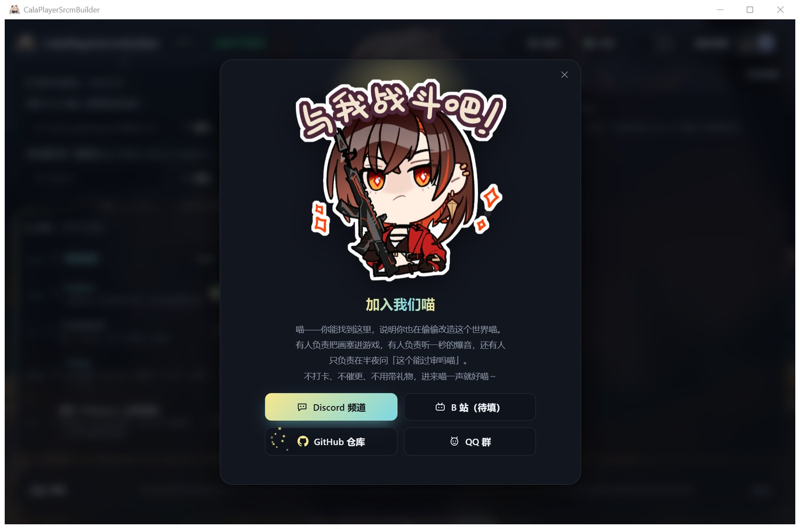](docs/images/community.jpg) | [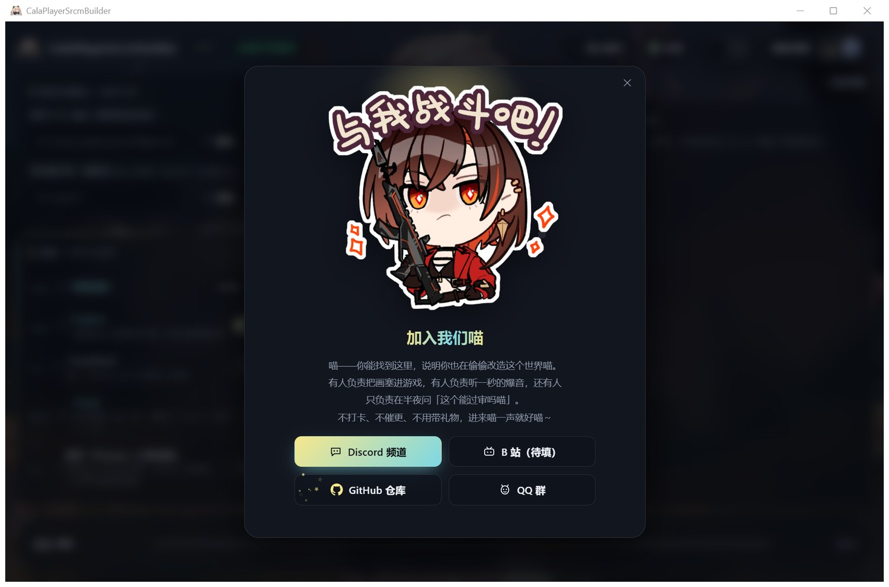](docs/images/community-hover.jpg) |

| "Leave me a star" (art on top, cat-talk below) | QQ group: the click already copied the number |
|---|---|
| [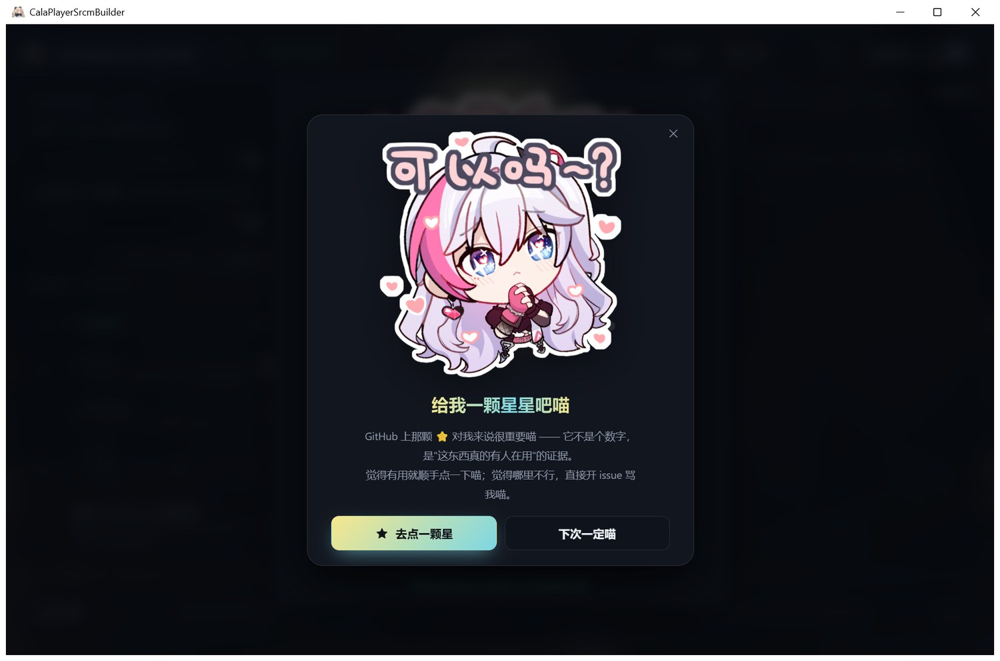](docs/images/star.jpg) | [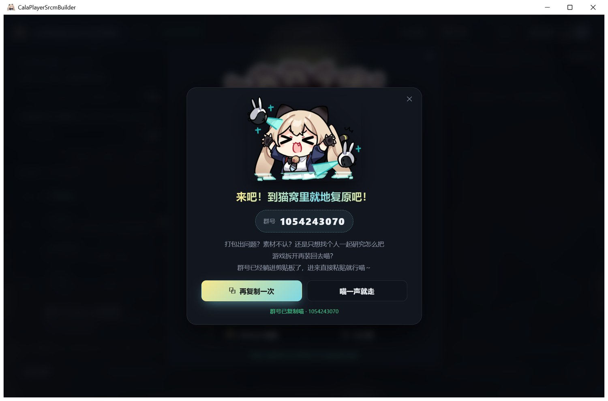](docs/images/qq.jpg) |

English UI, the minimum window size, and a few animation frames:

| English UI | Minimum window (960x620) still holds up |
|---|---|
| [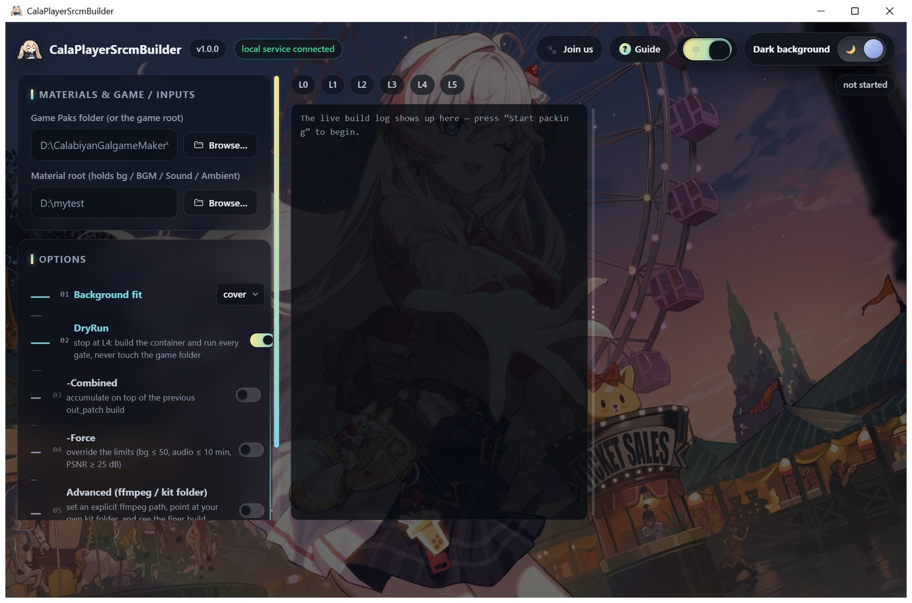](docs/images/ui-en.jpg) | [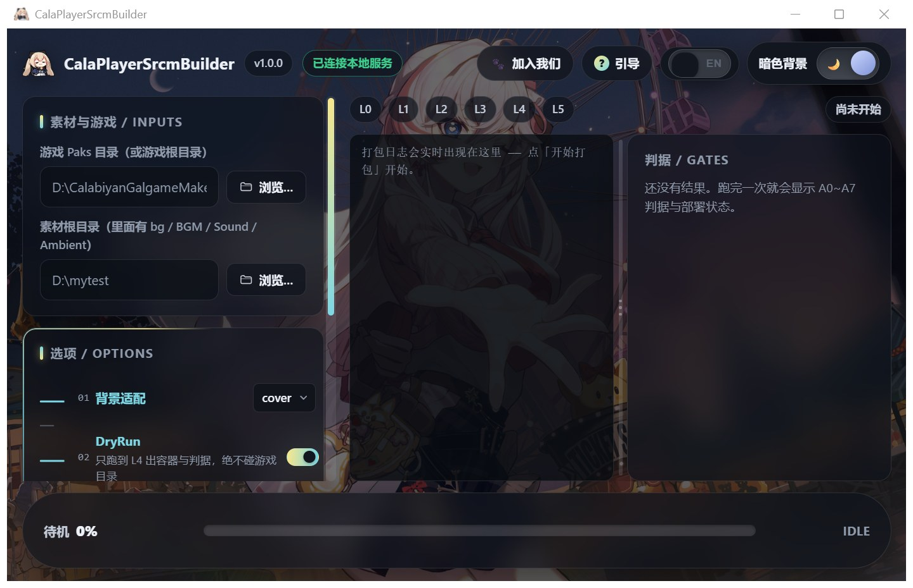](docs/images/ui-layout-min.jpg) |

| "Background fit" dropdown (Glide Select) | Options list (Line Sidebar: rows slide + tint) |
|---|---|
| [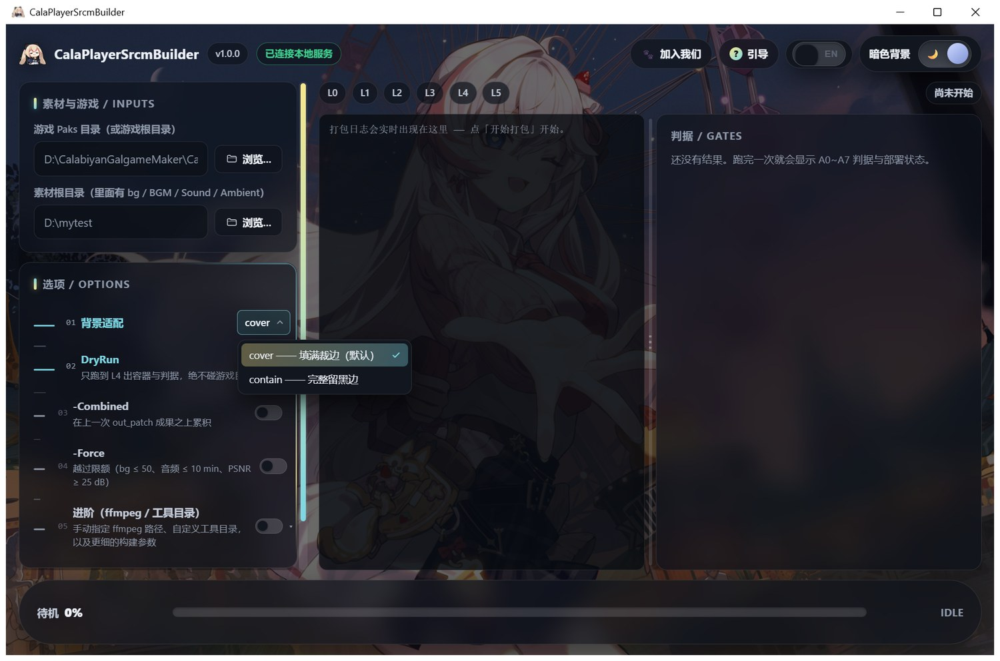](docs/images/dropdown.jpg) | [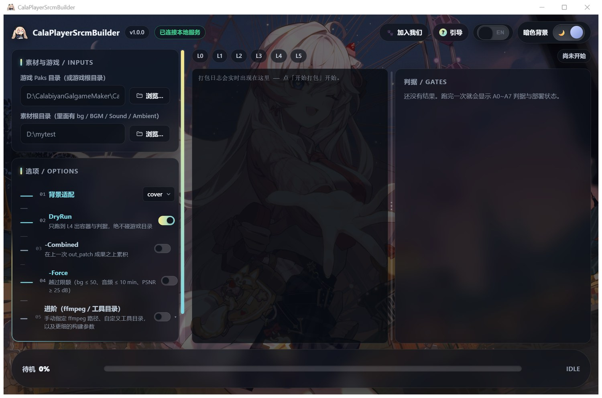](docs/images/line-sidebar.jpg) |

| The "scramble decode" ripple on a language switch | The zh/EN switch (Squish Switch, real spring + squish) |
|---|---|
| [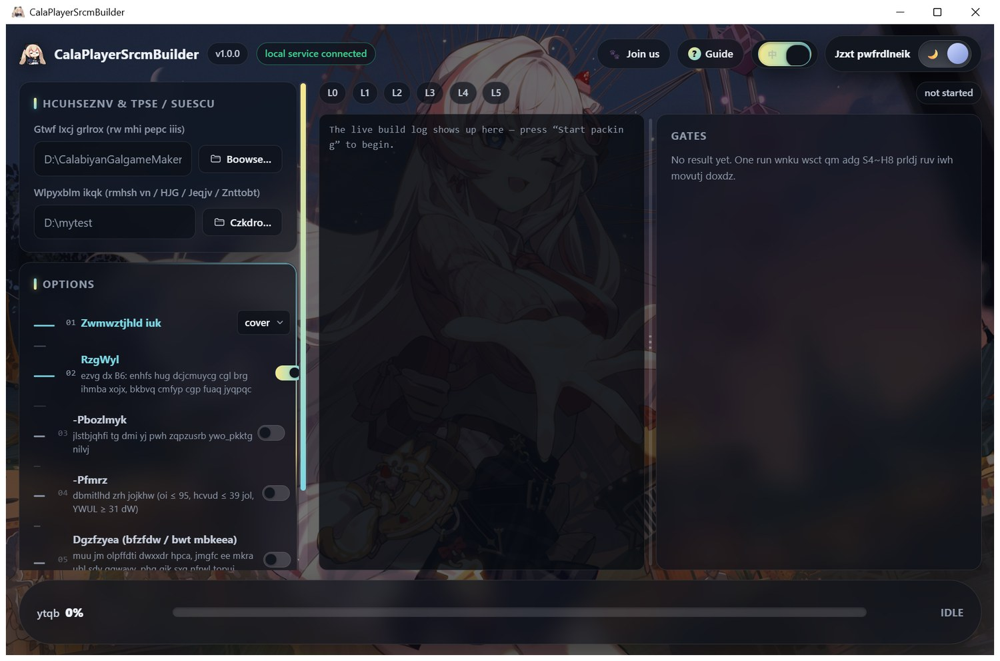](docs/images/scramble.jpg) | [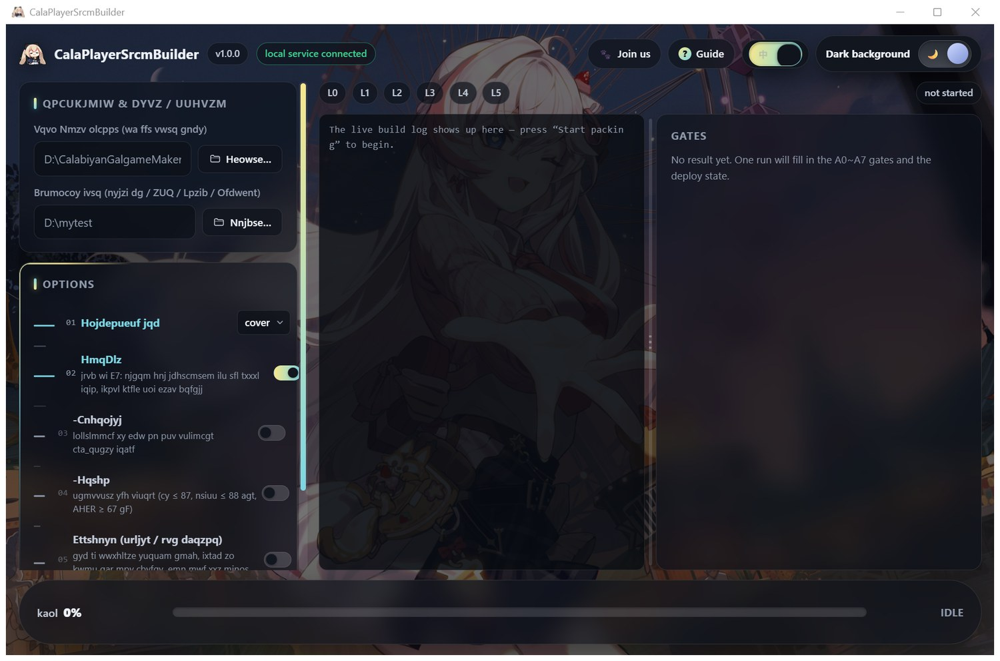](docs/images/squish.jpg) |

The cats inside the UI (originals live in `gui/frontend/public/` and ship with the Release):

|  |  |  |  |
|---|---|---|---|
| icon `T_UI.png` | guide: hello | guide: steps | guide: bye |
|  |  |  |  |
| community `joinus.png` | star `star.png` | QQ `joinQQ.png` | failure `cry.png` |

> Want your own cat? Drop the image into `gui/frontend/public/` (matching file name) and
> re-run `build_gui.ps1`.
