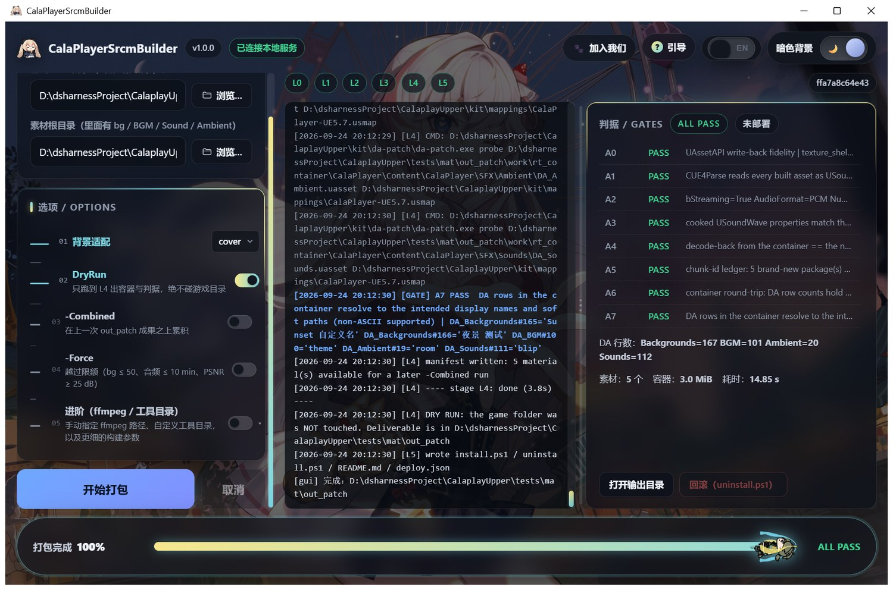
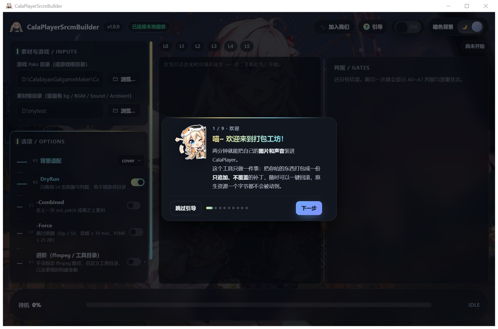
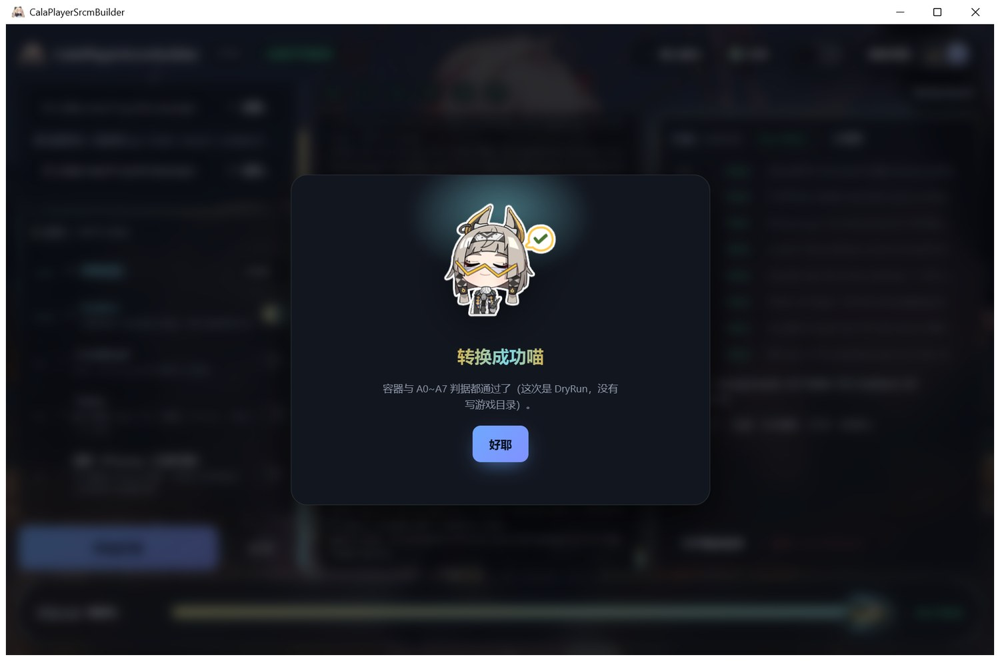
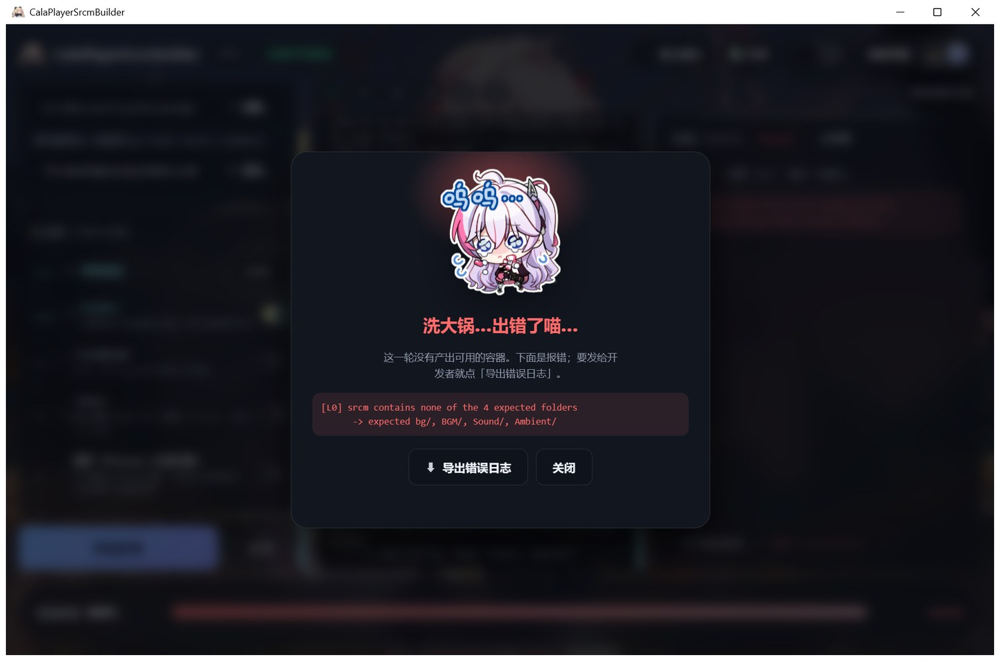
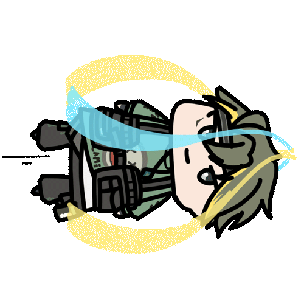

# CalaplayUpper

[English](README.en.md) | **中文**

为 CalaPlayer 打造的傻瓜式素材打包与注入工具。

把你喜欢的图片、音乐、音效丢进一个文件夹，点一下按钮，就能生成可以直接在游戏里使用的补丁包。不污染游戏原文件，随时可以一键卸载。

本项目是基于社区开源的 CalaPlayer 编辑器开发的辅助工具，仅用于个人学习与娱乐。

---

## ✨ 功能特性

* **一键打包**：把素材整理好，点一下就能生成游戏补丁
* **安全无污染**：所有修改都以补丁形式加载，不覆盖游戏原始文件
* **随时回滚**：不满意？一键卸载，游戏恢复原样
* **缩略图也是你的图**（v1.1.0 新增）：背景下拉条目的小预览会自动生成配套材质，显示你自己的图
* **背景不缩水**（v1.1.0 新增）：背景保持 2560×1440，2560×1440 的源图不再被重采样
* **防拉伸**（v1.1.0 新增）：竖屏/正方形图片默认拒绝并给出中文提示，宽屏图片一律放行
* **多 Mod 共存**（v1.2.0 新增）：别人做的 Mod 和你的 Mod 可以**同时生效**，而不是互相覆盖。
  工具左侧切到「多 Mod 合并」→ 选一个文件夹，它自己把里面的 Mod **嗅探**出来（勾选要参与的），
  点「开始合并」就得到**一个**补丁容器，装进游戏即可全部生效
* **打包即 Mod**（v1.2.0 新增）：单包打包勾上 `-ExportSrc`，输出目录里会多出一份
  `mod_src/<名字>_src/`（含 `manifest.json` 与全部资产），**可以直接丢进「多 Mod 合并」**和别人的 Mod 一起合并
* **中英双语**：界面支持中文和 English 切换
* **新手引导**：第一次打开会有九步引导，带你熟悉每个按钮
* **桌面端 GUI**：无需命令行，双击 exe 就能用
* **自动化校验**：打包过程自动检查每一步，出错会告诉你卡在哪里

## 📥 下载

去 **[Releases](https://github.com/killa0132/CalaplayUpper/releases)** 页面下载最新版本。

| 版本 | 说明 |
|---|---|
| **完全体（Full）** | **推荐**。自带 FFmpeg，支持 MP3 自动转码，开箱即用 |
| **精简版（Minimal）** | 体积更小，但不含 FFmpeg。你的电脑需要已经装好 FFmpeg 才能处理 MP3，否则只能用 WAV 格式 |

两个版本解压后都是 `CalaPlayerSrcmBuilderGUI.exe`，双击就能用，**不需要安装 Python 或 .NET**。

## 🚀 快速上手

### 第一步：准备素材

新建一个文件夹（比如 `我的素材`），在里面创建四个子文件夹：

```text
我的素材/
├── bg/        ← 背景图片（.png / .jpg / .jpeg）
├── BGM/       ← 背景音乐（.wav / .mp3）
├── Sound/     ← 音效（物品声、人物语音等）
└── Ambient/   ← 环境音（场景氛围音）
```

* 图片建议：**2560×1440（最理想，不会被缩放）** 或更高；支持 PNG、JPG、JPEG。
* 音频格式：**WAV 最稳**；MP3 需要 Full 版或本机已装 FFmpeg。

（四个目录名**大小写不敏感**；缺哪个就跳过哪个。）

### 第二步：打开工具

双击 `CalaPlayerSrcmBuilderGUI.exe`。第一次打开会有新手引导，跟着走一遍就行。

### 第三步：选择路径

* **游戏 Paks 目录**：选择你的 CalaPlayer 游戏根目录（比如 `D:\CalabiyanGalgameMaker\CalaPlayer`）
* **素材根目录**：选择你刚才创建的素材文件夹

### 第四步：开始打包

点击 **「开始打包」**，等待进度条跑完。成功后会在素材文件夹旁边生成一个 `out_patch` 文件夹，里面就是你的补丁包。

### 第五步：安装到游戏

> ⚠️ **安装前请先关闭游戏！**

进入 `out_patch` 文件夹，右键 `install.ps1` → 选择「在终端中运行」。如果 Windows 提示脚本被禁止，按照[开发文档](docs/DEVELOPER_GUIDE.md)里的说明放开执行策略即可，也可以直接跑：

```powershell
powershell -NoProfile -ExecutionPolicy Bypass -File .\install.ps1
```

安装完成后打开游戏，在 Create 编辑器里就能看到你新增的素材了。

## 🖼️ 界面预览

| 主界面 | 新手引导 |
|---|---|
| [](docs/images/ui-layout.jpg) | [](docs/images/guide.jpg) |

| 成功弹窗 | 失败弹窗 |
|---|---|
| [](docs/images/modal-ok.jpg) | [](docs/images/modal-fail.jpg) |

进度条跑起来是这样的（`chongci.gif` 当推进头部）：



更多截图（社区弹窗四入口、下拉与选项动效、乱码解码波纹、英文界面、最小窗口、几只猫）在[开发文档](docs/DEVELOPER_GUIDE.md)末尾。

## ⚙️ 进阶选项

工具界面里有几个选项，新手可以先不用管：

| 选项 | 作用 |
|---|---|
| 背景适配 | `cover` 填满裁边（推荐）；`contain` 保留完整图片，四周补黑边 |
| DryRun | 只试跑不安装，用来检查素材有没有问题 |
| Combined | 在上一次打包的基础上追加新素材，而不是重新开始 |
| Force | 当素材超过默认限制时，强制打包 |
| ExportSrc | 额外产出一份**可被合并的 Mod 源**（`mod_src/<名字>_src/`），可以直接喂给「多 Mod 合并」 |

默认限制：背景 ≤ 59 张、音频总时长 ≤ 10 分钟、图片质量 ≥ 25 dB。

## 🤝 多 Mod 共存（v1.2.0）

同一个游戏目录里**只能有一个** `_P` 补丁容器（同名容器互斥），所以「两个 Mod 同时装」是做不到的 ——
本工具的做法是先把它们**合并成一个**容器：

1. 左侧卡片顶部切到 **多 Mod 合并**。
2. 「游戏 Paks 目录（合并基底）」= 游戏的 `Content\Paks`（合并器只读它，永远不动游戏目录）。
3. 「Mod 根目录」：选一个文件夹，工具会**递归找出里面所有带 `manifest.json` 的 Mod**并列出（可勾选/移除）；
   已有总索引就优先用它，没有就自动生成。多个目录可以用 `;` 分隔，也可以对话框里多选。
   * 你自己的 Mod 就是这样产出的：单包打包时勾 **ExportSrc**。
4. 点「开始合并」→ 输出目录里得到 `CalaPlayer-Windows_P.{pak,ucas,utoc}`，**并自动装进游戏**（写前先把旧容器备份到
   `<输出目录>\install_backup_<时间戳>\`、写后逐个读回校验、失败自动还原）。重启游戏即可看到效果；
   想撤掉这一次安装就点判据面板右下角的 **「回滚」**（没装进游戏时它会是灰的）。
   调试时可以在选项里勾「仅产出不安装」——那就只出容器，不碰游戏目录。
5. 有冲突（两个 Mod 改同一张表的同一行 / 提供同一个文件）会**直接报错并且不产出容器**，并写明是谁和谁冲突——
   协议规定，不可关闭。

字段级协议（给 Mod 作者）见 [`docs/MOD_MERGE_PROTOCOL.md`](docs/MOD_MERGE_PROTOCOL.md)。

## 🧭 已知边界

* **时间轴单元格 / 编辑器右侧的「Background」预览块：现在会显示你新增的背景了**（v1.1.0 起）。
  * 做法（静态、不用常驻注入）：把每个新背景的 250×141 缩略图**追加进游戏自己的预览图集
    `T_BackgroundPreviews`**（放在图集末尾的空闲格上，序号 165 起），并让该背景的预览材质
    指向那一格。游戏自己会把这一格的坐标传给这两个控件。
  * 因为图集只有 59 个空闲格，**背景数量上限 = 59**（超过要 `-Force`，且超出的那张缩略图不显示）。
* **下拉缩略图的锐度会轻微降低（约 30%）**：由于游戏原生渲染机制（该缩略图只从图集里那一格采样，
  且 GPU 的 mip 选择让渲染落在两级的混合上），下拉列表里的小缩略图会比旧版略软一点——
  **但肉眼无感**，这是换取时间轴与预览块完整显示的合理妥协（`-NoAtlas` 可回到旧行为）。
* **不受影响**：背景下拉列表的内容、主菜单里的章节封面、以及**游戏画面里的背景本体**，都正常显示你自己的图。
* 曾经尝试的运行时补救方案（R2 / `--refresh-backgrounds`）**已废弃**：需要 Frida 常驻，会引发严重卡顿，
  而且效果重启即失效；游戏作者也确认所用的引擎接口不是预期路径。现行方案就是上面的静态图集路线，
  实现细节见 [`docs/DEVELOPER_GUIDE.md`](docs/DEVELOPER_GUIDE.md)（早期那份只读评估/设计文档已归档，
  不在本仓库内）。

## ⚠️ 注意事项

* **安装前必须先关闭游戏。** 游戏运行时 `.ucas` 文件被占用，会导致安装失败甚至游戏崩溃。
* Windows 可能提示"未知发布者"。这是因为 exe 没有签名，点击"更多信息" → "仍要运行"即可。
* 路径建议使用**纯英文**。游戏目录和素材目录都尽量避开中文和特殊符号，以免出现奇怪的问题。
* 你需要先拥有 **CalaPlayer 游戏本体**。这个工具只负责打包素材，不包含游戏。

## 🆕 更新日志

**v1.2.0（2026-09-27）** — 向后兼容的功能扩展：单包打包与「多 Mod 合并」打通：

* **多 Mod 共存**：界面上新增「多 Mod 合并」模式，选一个文件夹就自动嗅探里面的 Mod（并自动生成总索引），
  合并成**一个** `_P` 容器；协议规定冲突即报错、零产出（细节见上面的「多 Mod 共存」一节）。
* **合并完自动安装**：点完按钮就直接装进游戏（备份 → 写入 → 读回 → 失败自动还原），弹窗提示「已安装到游戏，重启生效」；
  选项里有「仅产出不安装」可关掉它做调试。
* **打包即 Mod**：`-ExportSrc` 让单包打包顺手产出一份可直接参与合并的 Mod 源（`mod_src/<名字>_src/`）。
* **合并前检查卡片**：必填项没填/路径不存在时会弹一张大卡片，一次列全部问题（而不是启动后 3 秒莫名失败）；
  单包模式用的是同一张卡片。
* **回滚按钮两个模式都有**：没装进游戏时置灰，装了就亮，点一下回到安装前。
* 界面细节：合并模式下的「协议规定，不可关闭」改成金色加粗 + 感叹号；修掉开始按钮在最小窗口下可能溢出；
  底部进度条的黑色外框收窄 22.5%（内容尺寸不变）；引导退出后恢复原来的滚动位置。

**v1.1.0（2026-09-25）** — 向后兼容的功能新增：

* **画质：背景保持 2560×1440**（路线 B）。背景贴图不再被压到 1920×1080：整块重建 cooked 贴图，
  源图是 2560×1440 时**一个像素都不重采样**（实测 PSNR 35.5 → 36.8 / 41.1 → 41.7 dB）。
* **背景缩略图修复**：下拉条目的小预览现在显示你自己的图（每个新背景自动生成配套的预览材质
  `MI_<名字>`，挂在背景表对应行的预览引用上；只追加、绝不替换原生条目）。留了 `-NoThumb`
  诊断开关，可回到旧行为。
* **宽高比约束（防拉伸）**：宽 > 高一律放行（非 16:9 会提示）；竖屏与正方形默认**拒绝打包**
  并给中文提示；加 `-Fit contain` 可让工具居中补黑边到 2560×1440 后放行。
* 回归测试扩到 29 场景，新增判据门 A8（缩略图通道）；A6 现在会把重建后的贴图**用 UE 解析器读回一遍**
  （尺寸/格式/12 级 mip/每级哈希）。

完整记录见 **[`CHANGELOG.md`](CHANGELOG.md)**。

## 📁 项目结构（开发者）
<details>
<summary>点开查看目录说明</summary>

```text
core/            打包引擎（不可改）
cli/             命令行入口（不可改）
gui/             界面层（可改）
  frontend/      Vue 3 源码
  dist/          构建产物
kit/             自包含工具链
tools-src/       C# 工具源码
tests/           回归测试
docs/            文档与图片
dist/            交付件（走 Release）
```

详细的「改哪个文件」对照表、CLI 开关说明、A0~A10 判据、原理与开发/调试指南，见
**[开发文档 `docs/DEVELOPER_GUIDE.md`](docs/DEVELOPER_GUIDE.md)**
（英文版 [`docs/DEVELOPER_GUIDE.en.md`](docs/DEVELOPER_GUIDE.en.md)）。

</details>

## 💬 社区与支持

* **GitHub Issues**：[提交问题或建议](https://github.com/killa0132/CalaplayUpper/issues)
* **Discord**：[加入频道](https://discord.com/invite/BGeYfMBwaw/login)
* **QQ 群**：1054243070

如果你觉得这个工具对你有帮助，欢迎在 GitHub 上点一个 ⭐ Star，这是对开发者最大的鼓励喵～

## 📜 许可证

本项目基于 [MIT License](LICENSE) 开源。

CalaplayUpper 是社区项目，与 CalaPlayer 官方无关。游戏素材版权归原作者所有。
